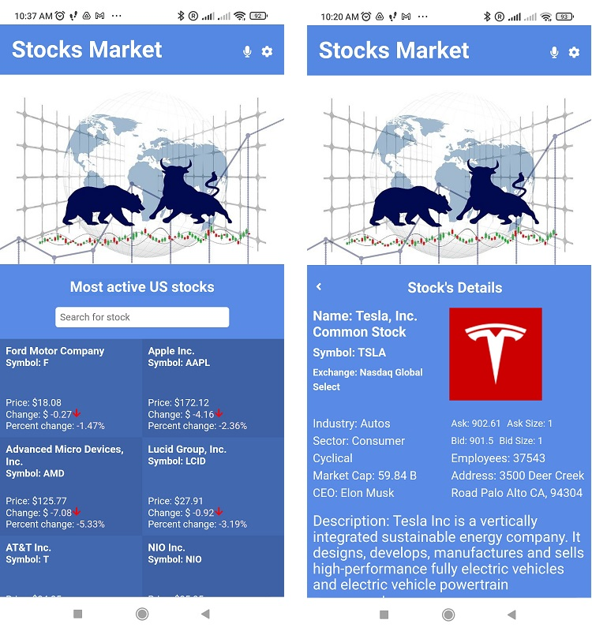

# Stocks Market SPA React-Redux Capstone project

> Capstone SPA project using React, Redux and API for the stocks market. Displaying stocks market information about the most traded US stocks and detailed info for the selected stock symbol.

## Short video presentation

[Short presentation](https://www.loom.com/share/45553fc5b9fa42e7b7e9e39982558011)

## Mini Demo

## Live Demo

[Live demo](https://stocks-market-data.netlify.app/)

## Description

This React capstone project is about building a mobile web application to check a list of metrics (numeric values) that you will create making use of React and Redux. Select an API that provides numeric data about a topic that you like and then build the webapp around it. The webapp will have several pages:

- one page with a list of items that could be filtered by some parameters; in the example below, it's a list of metrics that can be filtered by the country (imagine a search field to introduce the country name like Italy, Croatia, etc.). This page should be your homepage.
- one page for the item details; in the example, the detail page for Czech Republic cities with number of views.

## Built With

- Major languages: Javascript
- Frameworks: React.js, Redux
- Technologies used: Node.js, Babel, webpack
- Tested with: - ESLint (JavaScript linting), Stylelint (style linting) Jest, React Testing Library

### Prerequisites

- Internet connection and browser
- A text editor(preferably Visual Studio Code)
- Browser

### Setup

- This project was bootstrapped with [Create React App](https://github.com/facebook/create-react-app).

### Install

- [Git](https://git-scm.com/downloads)
- [Node](https://nodejs.org/en/download/)

### Usage

- Clone the repository using `git clone https://github.com/Hombre2014/Stocks-market`
- Change directory into the project folder: `cd stocks-market`
- Run `npm install`
- Run `npm start`
- A new browser will open automatically with application loaded

## Available Scripts

In the project directory, you can run:

### `npm start`

Runs the app in the development mode.\
Open [http://localhost:3000](http://localhost:3000) to view it in your browser.

The page will reload when you make changes.\
You may also see any lint errors in the console.

### `npm test`

Launches the test runner in the interactive watch mode.\
See the section about [running tests](https://facebook.github.io/create-react-app/docs/running-tests) for more information.

### `npm run build`

Builds the app for production to the `build` folder.\
It correctly bundles React in production mode and optimizes the build for the best performance.

The build is minified and the filenames include the hashes.\
Your app is ready to be deployed!

See the section about [deployment](https://facebook.github.io/create-react-app/docs/deployment) for more information.

### `npm run eject`

**Note: this is a one-way operation. Once you `eject`, you can't go back!**

If you aren't satisfied with the build tool and configuration choices, you can `eject` at any time. This command will remove the single build dependency from your project.

Instead, it will copy all the configuration files and the transitive dependencies (webpack, Babel, ESLint, etc) right into your project so you have full control over them. All of the commands except `eject` will still work, but they will point to the copied scripts so you can tweak them. At this point you're on your own.

You don't have to ever use `eject`. The curated feature set is suitable for small and middle deployments, and you shouldn't feel obligated to use this feature. However we understand that this tool wouldn't be useful if you couldn't customize it when you are ready for it.

### Deployment

Using [Netlify](https://app.netlify.com/).

## Author

👤 **Yuriy Chamkoriyski**

- GitHub: [@Hombre2014](https://github.com/Hombre2014)
- Twitter: [@Chamkoriyski](https://twitter.com/Chamkoriyski)
- LinkedIn: [axebit](https://linkedin.com/in/axebit)

## 🤝 Contributing

Contributions, issues, and feature requests are welcome!

Feel free to check the [issues page](https://github.com/Hombre2014/space-travelers/issues).

## Show your support

Give a ⭐️ if you like this project!

## Acknowledgments

The [Creative Commons license of the design](https://creativecommons.org/licenses/by-nc/4.0/) requires appropriate credit to the author.
Original design idea by [Nelson Sakwa on Behance](https://www.behance.net/sakwadesignstudio).

## 📝 License

This project is [MIT](./license.md) licensed.